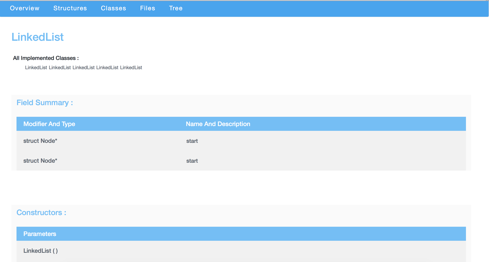
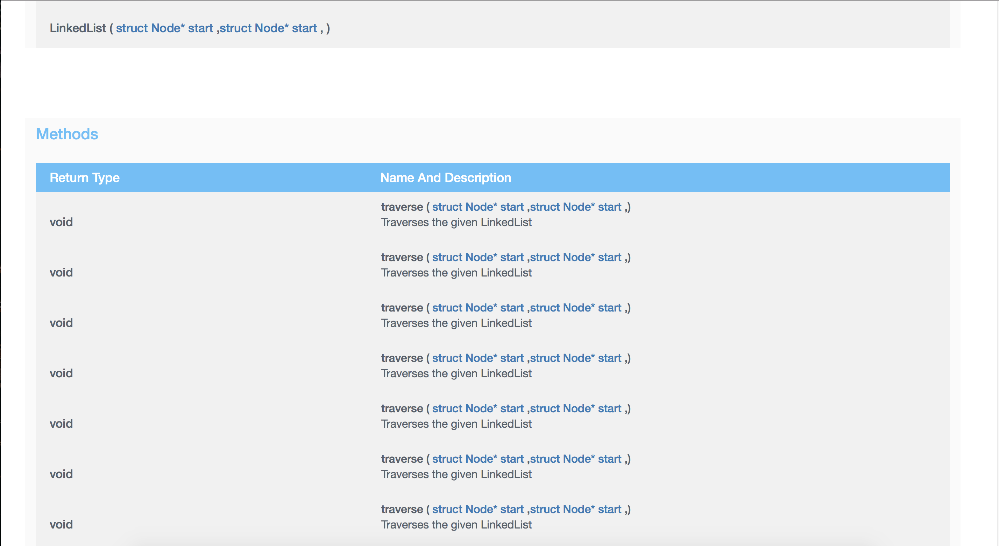

# C/C++ - Documentation Generator
  This is a javadoc like documentation generator for C/C++ Code.It is a command line tool developed on C# for Windows, Linux and OS X.
  
### Features - 
  * It generates the documentation for the following things in the code :
      1. Classes.
      2. Structures.
      3. Global/Local Functions and Variables.
      4. Header Files.
  * It can generate documentation for a single file or multiple files in a single direcotry.
  * Easy and Simple to use the user just needs to start the application with some Command Line Arguments.
  * The documentation Page generated by the Application is Clean and Responsive .i.e. Mobile Friendly.
  
### Command Line Arguments - 
  There are 2 options to the application in which one is mandatory.
  1. The path to the source code (File/ Directory)
  2. The path to the destination where the documentation needs to be generated (Directory).
  
  Note if no destination path is provided then it would generate the documentation in the directory of the source code.
  
### Some Screen Shots of the WebPage that is generated - 

